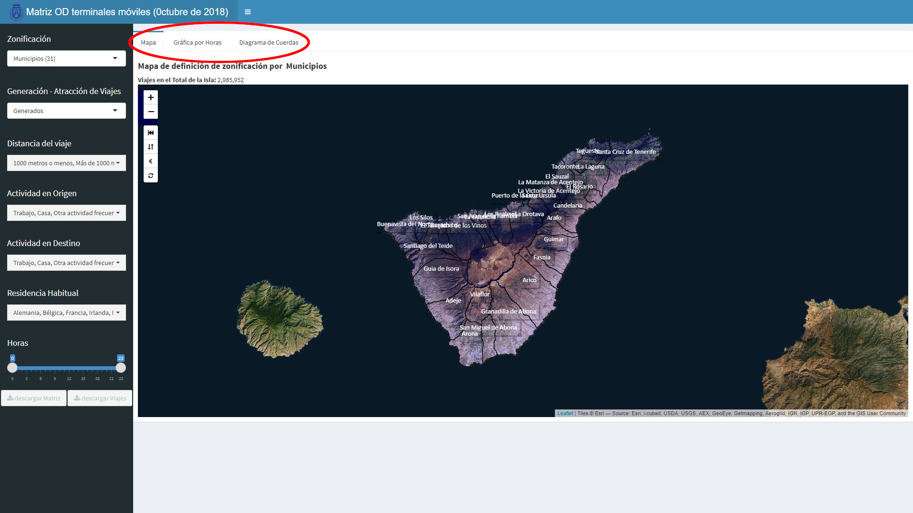

<style>
body {
text-align: justify}
</style>

```{r setup, include=FALSE}
knitr::opts_chunk$set(echo = TRUE)
```

## Introducción

Esta aplicación permite visualizar los resultados de la matriz [origen-destino](https://es.wikipedia.org/wiki/Distribución_de_viajes){:target="_blank"} de día laborable de octubre de 2018 obtenida mediante el seguimiento de teléfonos móviles, aplicando diferentes [análisis y filtros](01_analisis.html).  

Los datos a visualizar se presentan en diferentes formas, que se pueden seleccionar en las pestañas superiores:

1. [En un plano.](02_plano.html)  
2. En gráfica horaria.  
3. En diagrama de cuerdas.  


<center></center>
