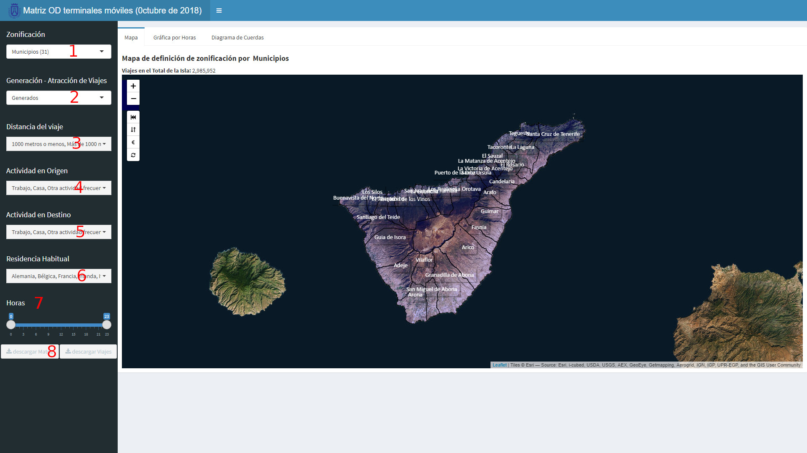

[<< Introducción](00_inicio.html)                                                                         [Vista de Plano >> ](02_plano.html) 

### Selección del análisis a realizar

Por otro lado, los datos a visualizar se le pueden aplicar diferentes zonificaciones, análisis y filtros y permitiéndose la descarga de los datos:

**1. Zonificación:**  

  + Macrozonas de transporte.- Se divide la isla en 11 macrozonas de transporte para el estudio de flujo de viajes entre grandes áreas de la isla.  
  + Municipios.- Permite estudiar la movilidad entre los distintos municipios de la isla.  
  + Zonas de transporte.- División de la isla de Tenerife en 150 zonas de transporte. Es la visualización con mayor granularidad. 
  
**2. Generación-Atracción de Vijaes**  

Permite cambiar los resultados entre viajes generados/atraídos por cada zona o matriz de orígenes/destino de los viajes. Según se seleccione generados o atraídos se agregaraán los datos con orígen o destino en cada zona.  

**3. Distancia del viaje:**  

Permite seleccionar entre viajes mayores de 1.000 metros o menores de 1.000 metros (o la suma de ambos que es la selección por defecto). Se puede suponer que los viajes de menos de 1.000 metros se realizan a pie.  

**4. Actividad en origen.-** Lugar desde el que se inicia el viaje diferenciando entre:  

  + Casa  
  + Trabajo  
  + Otra actividad frecuente  
  + Actividad no frecuente  
  + Extranjeros  
  
Los criterios que se emplean para clasificar los propósitos de los viajes son la frecuencia con la que un usuario visita un lugar y el tiempo de estancia en el mismo. Así, un viaje a un lugar frecuentado cuatro veces por semana por un usuario que permanece en éste unas 6-8 horas cada día, se considera un viaje con propósito “trabajo” mientras que un viaje a un lugar frecuentado dos veces por semana por un usuario que permanece en dicho lugar unas 2-3 horas se considera un viaje de “otra actividad frecuente”. El resto de actividades sin unas pautas identificadas son “actividad no frecuente”. Los viajes realizados por los extranjeros que visitan la isla se encuadran dentro de la actividad "extranjeros".  

**5. Actividad en destino.-** O que se realiza en el lugar de destino en del viaje. Los criterios para la segmentación son los mismos que en el punto anterior.  

**6. Residencia habitual.-** Permite segmentar los viajes según el lugar de residencia habitual de la persona que lo realiza distinguiendo entre:  

  + Alemania  
  + Bélgica  
  + Francia  
  + Irlanda  
  + Italia  
  + Países Bajos  
  + Países Nórdicos  
  + Portugal  
  + Reino Unido  
  + Resto de España  
  + Resto de Europa  
  + Resto del Mundo  
  + Rusia  
  + Tenerife  
  
**7. Hora.-** Permite cálculo de viajes según la hora de inicio de los mismos. 

**8. Descargas.-** Permite la descarga de la matriz de viajes y del listado de viajes según los filtros aplicados en formato plano de texto.  

[<< Introducción](00_inicio.html)                                                                         [Vista de Plano >> ](02_plano.html)  