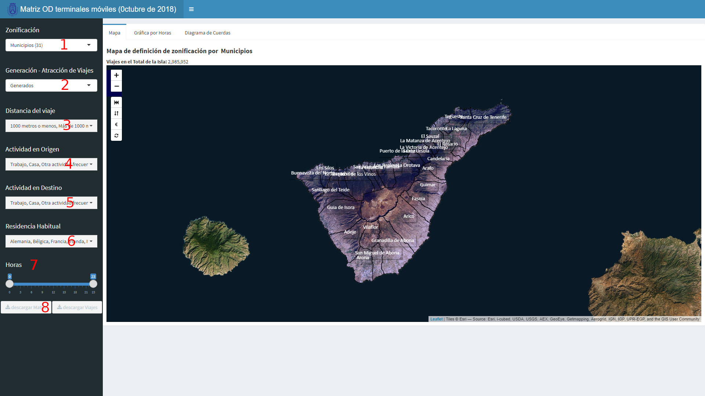

```{r setup, include=FALSE}
knitr::opts_chunk$set(echo = TRUE)
```

## Introducción

Esta aplicación permite visualizar los resultados de la matriz [origen-destino](https://es.wikipedia.org/wiki/Distribución_de_viajes){:target="_blank"} de día laborable de octubre de 2018 obtenida mediante el seguimiento de teléfonos móviles.  

Los datos a visualizar se presentan en diferentes formas, que se pueden seleccionar en las pestañas superiores:

1. En un plano.  
2. En gráfica horaria.  
3. En diagrama de cuerdas.  


### Selección del análisis a realizar

Por otro lado, los datos a visualizar se le pueden aplicar diferentes zonificaciones, análisis y filtros y permitiéndose la descarga de los datos:

**1. Zonificación:**  

  + Macrozonas de transporte.- Se divide la isla en 11 macrozonas de transporte para el estudio de flujo de viajes entre grandes áreas de la isla.  
  + Municipios.- Permite estudiar la movilidad entre los distintos municipios de la isla.  
  + Zonas de transporte.- División de la isla de Tenerife en 150 zonas de transporte. Es la visualización con mayor granularidad. 
  
**2. Generación-Atracción de Vijaes**  

Permite cambiar los resultados entre viajes generados/atraídos por cada zona o matriz de orígenes/destino de los viajes. Según se seleccione generados o atraídos se agregaraán los datos con orígen o destino en cada zona.  

**3. Distancia del viaje:**  

Permite seleccionar entre viajes mayores de 1.000 metros o menores de 1.000 metros (o la suma de ambos que es la selección por defecto). Se puede suponer que los viajes de menos de 1.000 metros se realizan a pie.  

**4. Actividad en origen.-** Lugar desde el que se inicia el viaje diferenciando entre:  

  + Casa  
  + Trabajo  
  + Otra actividad frecuente  
  + Actividad no frecuente  
  + Extranjeros  
  
Los criterios que se emplean para clasificar los propósitos de los viajes son la frecuencia con la que un usuario visita un lugar y el tiempo de estancia en el mismo. Así, un viaje a un lugar frecuentado cuatro veces por semana por un usuario que permanece en éste unas 6-8 horas cada día, se considera un viaje con propósito “trabajo” mientras que un viaje a un lugar frecuentado dos veces por semana por un usuario que permanece en dicho lugar unas 2-3 horas se considera un viaje de “otra actividad frecuente”. El resto de actividades sin unas pautas identificadas son “actividad no frecuente”. Los viajes realizados por los extranjeros que visitan la isla se encuadran dentro de la actividad "extranjeros".  



**5. Actividad en destino.-** O que se realiza en el lugar de destino en del viaje. Los criterios para la segmentación son los mismos que en el punto anterior.  

**6. Residencia habitual.-** Permite segmentar los viajes según el lugar de residencia habitual de la persona que lo realiza distinguiendo entre:  

  + Alemania  
  + Bélgica  
  + Francia  
  + Irlanda  
  + Italia  
  + Países Bajos  
  + Países Nórdicos  
  + Portugal  
  + Reino Unido  
  + Resto de España  
  + Resto de Europa  
  + Resto del Mundo  
  + Rusia  
  + Tenerife  
  
**7. Hora.-** Permite cálculo de viajes según la hora de inicio de los mismos. 

**8. Descargas.-** Permite la descarga de la matriz de viajes y del listado de viajes según los filtros aplicados en formato plano de texto.  

### Vista de Plano  

En esta vista se podrán generar diferentes planos:  

1. Plano de definición de zonas.  
2. Planos con datos de los viajes con origen o destino en una de las zonas.  
3. Planos con los viajes generados o atraídos por cada una de las zonas.  
4. Planos de saldo de viajes (generados menos atraídos).  

El texto encima del plano indicará en cada momento el tipo de plano que se presenta y un sumario de los viajes totales.

**Planos de definición de zonas.-** Se generan al modificar la selección en el desplegable de zonificación o al presionar el botón  `r shiny::icon("fast-backward", lib = "glyphicon")`. Este plano muestra la zonificación seleccionada en **Zonificación** con etiquetas de nombres en caso de macrozonas y municipios o número para zonas de transporte.  

**Planos con datos de los viajes con origen o destino en una de las zonas.-** Haciendo click directamente sobre una de las zonas -ya sea en el plano de macrozonas, municipios o zonas de transporte- se calculará para cada una de las zonas en las que está dividida la isla los viajes con **origen o destino** en la zona seleccionada. Los viajes con **origen** en la zona seleccionada se mostrarán en caso de que en el desplegable *Generación - Atracción de Viajes* se haya seleccionado la opción *Generación*. Igualmente en caso de que se seleccione la opción *Atracción* se mostrarán los viajes con origen en cada una las zonas cuyo **destino** es la zona seleccionada.  

**Planos con los viajes generados o atraídos por cada una de las zonas.-** Presionando el botón `r shiny::icon("exchange-alt", lib = "font-awesome")` se presenta en cada zona del mapa el número de viajes generados o atraídos por cada zona dependiendo de la selección realizada en el desplegable *Generación - Atracción de Viajes*.  


 
